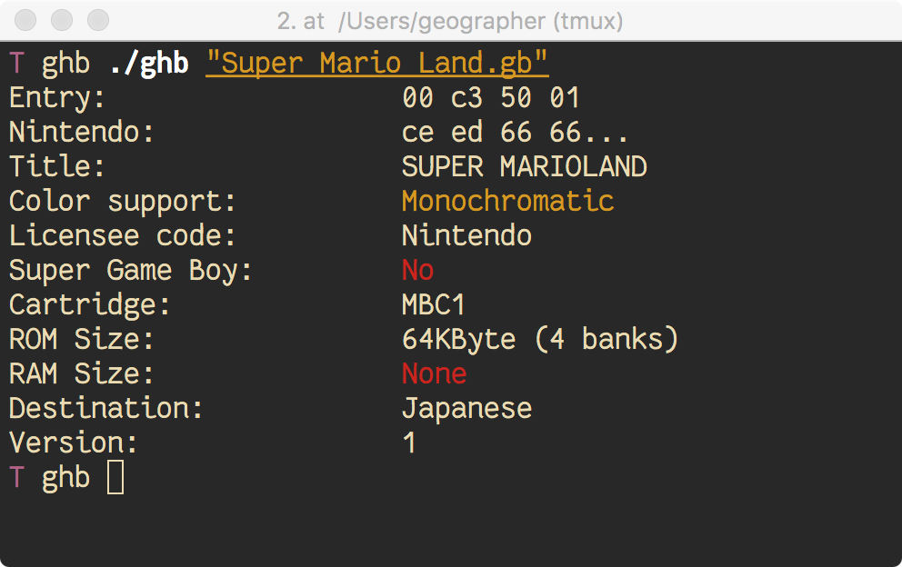

# GameBoy Header Beautifier

[](https://travis-ci.org/Geospace/ghb)

GameBoy Header Beautifier (GHB) is a command line tool to help you retrieve
informations from a GameBoy (Color) ROM. It reads its header and outputs
all it finds.

<p align="center">
  
</p>

Check out [this link](http://gbdev.gg8.se/wiki/articles/The_Cartridge_Header)
for more informations about the GameBoy cartridge header.

## Installation

Clone the repo, make, run.

``` terminal
$ git clone git@github.com:Geospace/ghb.git
$ cd ghb/
ghb $ make
ghb $ ./ghb
GHB is a GameBoy Header Beautifier.
It reads a GambeBoy (Color) ROM file and prints some informations.

USAGE:
        ./ghb [-hf] [ROM file]

OPTIONS:
        -h              Print this usage and exit.
        -f              Force file analysis even though it does not seem valid.
```

GHB is written in plain C11 and should run on approximately any modern system.

Although development happen primarily on macOS and Linux,
GHB should build and work on Windows. You may have to [enable the ANSI
sequences](https://docs.microsoft.com/en-us/windows/console/console-virtual-terminal-sequences)
in your terminal emulator to enjoy the colors.

## Contribute

Open an issue, a pull request, fork the project, do whatever you want ! :)
